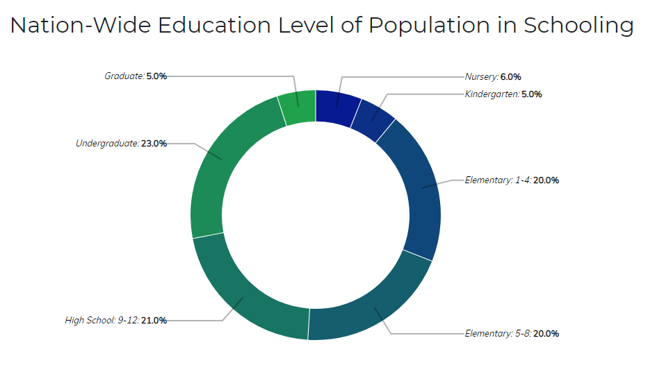
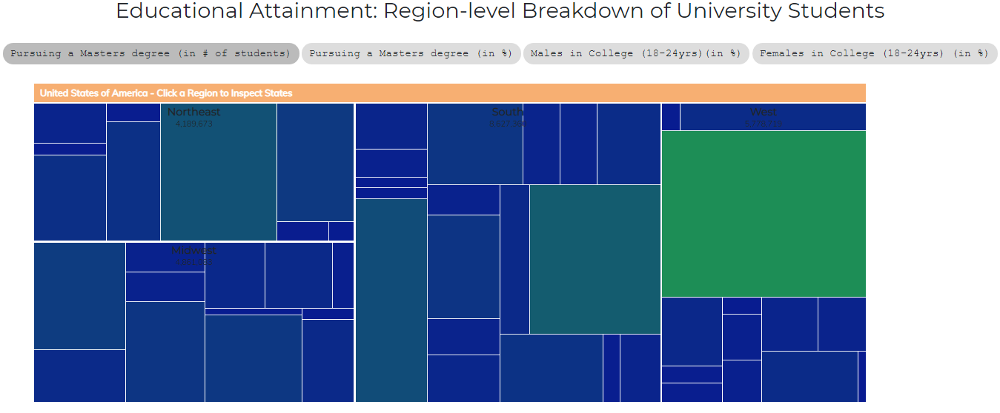
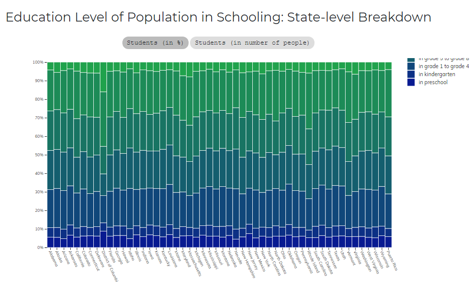

# Τελική Αναφορά στο Μάθημα Επικοινωνία Ανθρώπου-Υπολογιστή

## Σύνοψη
* Ονοματεπώνυμο: Ελένη Μαρία Μητσοπούλου
* ΑΜ: Π2017018

Το κείμενο αυτό αποτελεί την τελική μου αναφορά για την Εργασία Ανάπτυξης με θέμα Οπτικοποίηση δεδομένων εκπαιδευτικού συστήματος των ΗΠΑ, στα πλαίσια του μαθήματος Επικοινωνία Ανθρώπου-Υπολογιστή του τρίτου εξαμήνου. Με την χρήση HTML, CSS, και προγραμμάτων JavaScript που περιέχουν λειτουργίες από τις βιβλιοθήκες D3.js, έχω αναπτύξει μια ιστοσελίδα η οποία οπτικοποιεί έναν αριθμό στατιστικών δεδομένων με χρήση JavaScript, τα οποία αναλύω παρακάτω.

## Εισαγωγή
Η εργασία χωρίζεται σε δύο παραδοτέα. Αρχικά στο πρώτο παραδοτέο, ανατεθήκαμε να κάνουμε αλλαγές στο χρώμα των έτοιμων γραφημάτων της σελίδας, καθώς και να προσθέσουμε νέες ιδιότητες, συγκεκριμένα ενός αφηγητή κειμένου, έναν ήχο κατά την επιλογή γραφήματος και σχεδίαση για την ομαλή εμφάνιση της σελίδας σε διαφορετικές οθόνες. Στο δεύτερο παραδοτέο, χρειάστηκε να τροποποιήσουμε τη σελίδα ώστε να εμφανίζει μόνο ένα γράφημα κάθε φορα και, σε μια επόμενη σελίδα, να εμφανίζονται 3 διαφορετικά γραφήματα με νέα δεδομένα της επιλογής μας.

## Ανάλυση σχετικών έργων και εργαλείων
Υλοποίησα το μεγαλύτερο μέρος της εργασίας με την χρήση των text editors που διαθέτει το Github. Για την εύρεση νέων γραφημάτων, έψαξα προσεκτικά τα παραδείγματα που εμφανίζονται στο Gallery του επίσημου αποθετηρίου του D3, ενώ τα νέα στατιστικά στοιχεία τροποποιήθηκαν με την χρήση εξωτερικών προγραμμάτων, συγκεκριμένα το Notepad++ και το LibreOffice Calc. Ο αφηγητής κειμένου που χρησιμοποιήθηκε για το πρώτο παραδοτέο ονομάζεται Responsive Voice, είναι ένα πρόγραμμα γραμμένο σε JavaScript που διαθέτει τη μέθοδο text-to-speech.

## Αποτελέσματα με λεζάντες σε ενδεικτικές οθόνες
### Πρώτο Παραδοτέο
* Αλλαγή χρωμάτων των γραφημάτων και μορφής των κουμπιών:

* Responsive design:
(Θα προστεθεί gif)

### Δεύτερο Παραδοτέο
* Εμφάνιση μόνο ενός γραφήματος κάθε φορά:
(Θα προστεθεί gif)

* Τρία νέα γραφήματα για τα ήδη υπάρχοντα δεδομένα:
(Θα προστεθεί εικόνα)

* Τρία νέα γραφήματα για νέα δεδομένα:
(Θα προστεθεί εικόνα)

## Βιβλιογραφία και σύνδεσμοι 
* http://www.statistics.gr/el/statistics/-/publication/SAM03/-
* https://responsivevoice.org/
* https://github.com/d3/d3/wiki/Gallery
